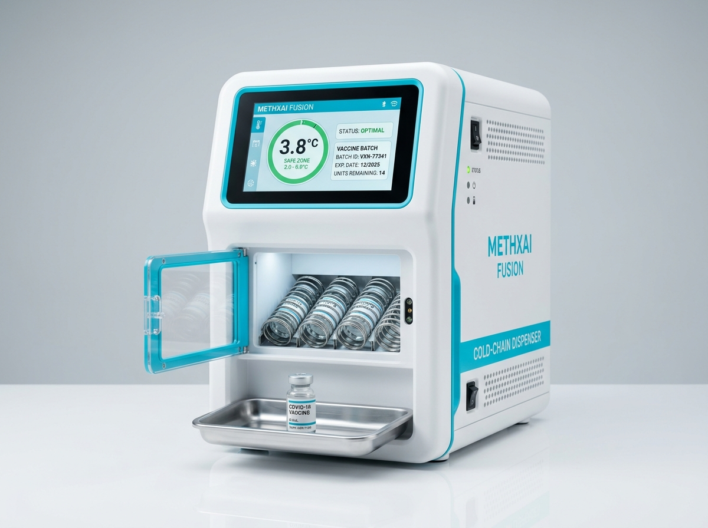
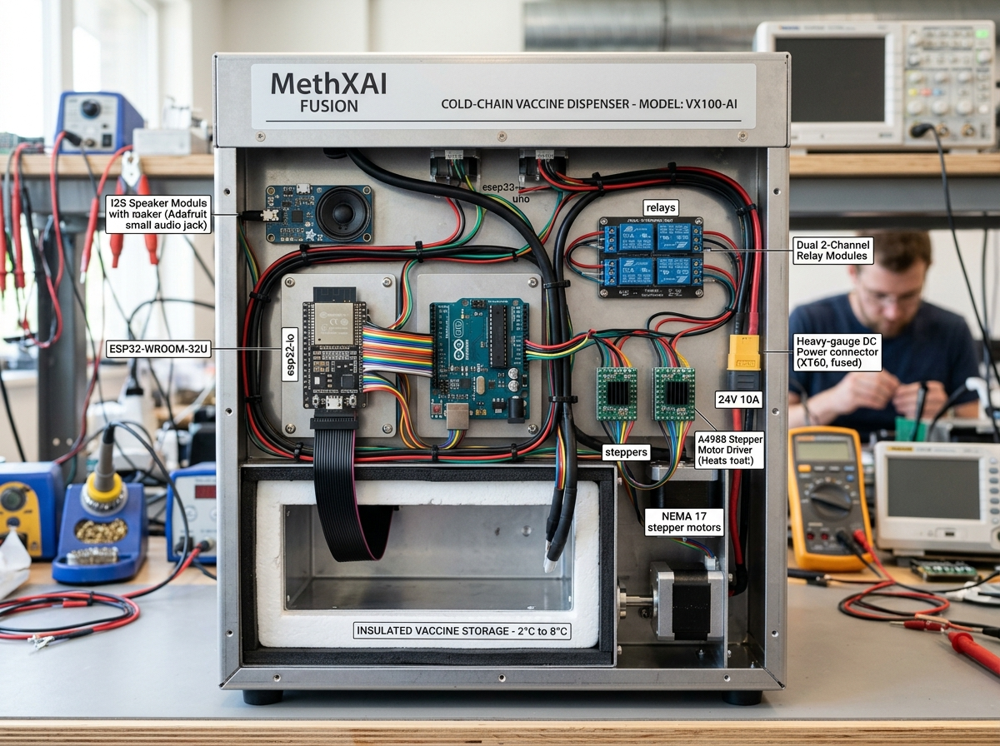

# MethXAI Fusion: Cold Chain Integrity Monitoring & Intelligent Dispensing Ecosystem

MethXAI Fusion is an end-to-end, IoT-enabled cold chain monitoring and automated vaccine distribution platform. The system combines real-time sensor telemetry, automated excursion detection, local LLM triage assessment, multi-motor hardware dispensing, and an interactive React management dashboard.

---

## Table of Contents

- [Overview](#overview)
- [System Architecture](#system-architecture)
- [Key Features](#key-features)
- [Repository Structure](#repository-structure)
- [Backend Specification](#backend-specification)
- [Frontend Dashboard](#frontend-dashboard)
- [Hardware & Firmware Specification](#hardware--firmware-specification)
- [Cold Chain Security Locks](#cold-chain-security-locks)
- [Prerequisites](#prerequisites)
- [Installation & Setup](#installation--setup)
- [Running the System](#running-the-system)
- [API Reference](#api-reference)

---

## Overview

Vaccine and pharmaceutical supply chains rely on strict temperature limits (typically 2.0°C to 8.0°C for standard refrigerated vaccines, or down to -90°C for ultra-cold storage). Any breach (temperature excursion) can compromise product efficacy.

MethXAI Fusion provides continuous monitoring, automated hold placement on compromised batches, voice-assisted AI triage via local LLM, and controlled physical dispensing via an integrated ESP32 and Arduino Uno hardware controller.

---

## Hardware Prototype

### Front View (Dispensing Unit & LVGL GUI)



### Back View (Microcontroller Layout & Wiring)



---

## System Architecture

```
                                +-----------------------+
                                |  React Vite Dashboard |
                                |  (Port 5173 / HTTP)   |
                                +-----------+-----------+
                                            |
                                  HTTP REST / WebSocket (/ws)
                                            |
                                            v
+-----------------------+       +-----------+-----------+       +-----------------------+
|  Local Ollama LLM     | <---> |  FastAPI Python      | <---> |  Mac Audio Engine     |
|  (llama3.2:1b:11434)  |       |  Backend (Port 8000)  |       |  (TTS Voice / WAV)    |
+-----------------------+       +-----------+-----------+       +-----------------------+
                                            ^
                                            | HTTP POST (/api/telemetry, /triage)
                                            |
                                +-----------+-----------+
                                |   ESP32 Controller    |
                                |  (LVGL Display & WiFi)|
                                +-----------+-----------+
                                            |
                                  UART (115200 Baud)
                                            |
                                            v
                                +-----------------------+
                                |  Arduino Uno Shield   |
                                |  (Motors, Relays, IR) |
                                +-----------------------+
```

---

## Key Features

- Real-Time Telemetry Tracking: Monitors temperature, relative humidity, SPO2, heart rate, and IR beam status.
- Local AI Triage (Ollama): Evaluates sensor metrics against product safety profiles using local `llama3.2:1b` model.
- Automated Dispense Locks: Prevents motor execution if a batch is flagged with `HOLD` or `EXCURSION` status.
- Real-Time WebSocket Streaming: Pushes instant updates to connected dashboard clients on telemetry changes, alerts, and motor status.
- Voice Synthesis & Speech Output: Provides audible prompts on dispense completion and AI triage summaries.
- LVGL Mirror Interface: Replicates physical dispenser 14-screen interface state directly inside the web UI.
- Multi-Motor Actuation: Interfaces with stepper motors (28BYJ-48), DC BO motors, relays, gate servos, drop servos, and obstacle IR sensors.

---

## Repository Structure

```
methxai_fusion/
├── start_all.sh                 # Unified startup script (Backend + Ollama + Frontend)
├── start_backend.sh             # Backend startup script (Port clearing + venv + Ollama)
├── help.txt                     # Quick command reference
├── README.md                    # System documentation
├── backend/                     # FastAPI backend application
│   ├── main.py                  # Core REST API, WebSocket server, and business logic
│   ├── audio_generator.py       # WAV audio generator for voice prompts
│   ├── test_connection.py       # API connection verification utility
│   ├── requirements.txt         # Python dependencies
│   ├── run.py                   # Script runner
│   └── static/                  # Static audio assets
├── frontend/                    # React Vite web dashboard
│   ├── index.html               # Main HTML entry point
│   ├── vite.config.js           # Vite build configuration
│   ├── package.json             # Node.js dependencies and scripts
│   └── src/                     # Source application code
│       ├── App.jsx              # Main App layout & route router
│       ├── main.jsx             # React DOM entry point
│       ├── components/          # Reusable UI components (Sidebar, Header, MacVoiceAudit)
│       ├── pages/               # Application pages (Overview, LVGLControl, Shipments, etc.)
│       ├── services/            # API client (api.js) and WebSocket client (socket.js)
│       ├── hooks/               # Custom React hooks (useApi.js)
│       └── utils/               # Formatting helpers and state store
├── hardware/                    # Microcontroller firmware
│   ├── esp/                     # ESP32 code & LVGL graphics library
│   │   └── Lib/                 # UI screens, cold_chain_controller.h/.c, Lib.ino
│   └── ardunio/                 # Arduino Uno motor controller firmware
│       └── uno.ino              # Motor shield driver, IR sensor logic, and UART parser
└── ai/                          # AI model configuration & assets
```

---

## Backend Specification

The backend service is powered by FastAPI running on Uvicorn (Port 8000).

### Core Responsibilities

1. Data Ingestion: Accepts `/api/telemetry` POST requests from hardware units or simulated generators.
2. Intelligent Assessment: Integrates with local Ollama service (`http://127.0.0.1:11434`) running `llama3.2:1b` to process natural language voice queries alongside sensor metrics.
3. Excursion Guardrails: Checks incoming temperature readings against specific medicine thresholds:
   - Medicine M1 / M4 / M5 / M6: 2.0°C to 8.0°C
   - Medicine M2: -25.0°C to -15.0°C
   - Medicine M3: -90.0°C to -60.0°C
4. Motor Dispatching: Parses motor control requests (`M3 ON`, `M4 ON`, `R0 ON`, `R1 ON`, `STEP 512`, `GATE OPEN`, `GATE CLOSE`, `DROP`, `STOP`) and validates authorization before sending commands to hardware via WebSocket/UART.

---

## Frontend Dashboard

The dashboard is built with React 18, Vite, React Router v7, Recharts, and Lucide React.

### Available Page Views

- Overview (`/`): Summary cards, active shipments count, temp trends, recent alerts, and real-time telemetry feed.
- LVGL Motor Control (`/lvgl-control`): Hardware control page featuring active screen selection (Screens 1–14), motor test controls, cold-chain lock override switches, and live voice audit input.
- Live Shipments (`/shipments`): Searchable and filterable table of active and past shipments.
- Shipment Detail (`/shipments/:id`): Granular temperature/humidity time-series charts, route checkpoints, and excursion logs.
- Temperature Monitoring (`/temperature`): Product range configurations, sensor connection status, and excursion analysis.
- Vaccine Batches (`/batches`): Inventory view with batch release status (`RELEASED`, `HOLD`, `REVIEW_REQUIRED`).
- Checkpoints & Alerts (`/alerts`): High/Medium severity excursion alert management and checkpoint verification logs.
- Reports (`/reports`): Summary reports and dispenser hardware integration diagnostics.
- Settings (`/settings`): API base URL configuration, storage threshold customization, and notification settings.

---

## Hardware & Firmware Specification

### 1. ESP32 Microcontroller (Display & Networking)

- Display Driver: 480x320 TFT display with LVGL (Light and Versatile Graphics Library).
- Wireless: Connects to local Wi-Fi to send telemetry and query the FastAPI backend.
- Audio Output: I2S speaker driver (`SPK_BCLK=26`, `SPK_LRC=27`, `SPK_DOUT=25`) for playing back `.wav` voice responses.
- Serial Link: Communicates with Arduino Uno via `HardwareSerial(2)` on `RX=16`, `TX=17` at 115200 baud.

### 2. Arduino Uno (Motor Shield Controller)

- Stepper Motor: 28BYJ-48 stepper motor connected via AFMotor library on Port 1 (`pillStepper`).
- DC BO Motors: Dual DC motors on Port 3 (`boM3`) and Port 4 (`boM4`).
- Relays: Dual active-low relay channels (`RELAY_MOTOR_A0` on pin A0, `RELAY_MOTOR_A1` on pin A1).
- Servos: Gate servo on pin 10 (`GATE_OPEN=10°`, `GATE_CLOSE=65°`) and Drop servo on pin 9 (`DROP_ANGLE=150°`).
- IR Sensor: Obstacle detection sensor on pin A3 (`IR_PIN`) for detecting dispensed products and preventing motor jams.

---

## Cold Chain Security Locks

To guarantee vaccine safety, the software and firmware enforce safety locks:

1. Batch Status Hold: If a batch fails temperature compliance (e.g., Batch BTC-M4-2402 exceeding 8.0°C), its status is automatically changed to `HOLD`.
2. Motor Control Block: When a dispense action (`M3 ON`, `M4 ON`, `R0 ON`, `R1 ON`, `STEP 512`, `VOICE_DISPENSE`) is issued for a slot tied to a held batch, the backend returns HTTP 400 with `Cold Chain Security Lock`.
3. Manual Override: Requires explicit parameter `overrideLock: true` from authorized operator interfaces during diagnostic testing.

---

## Prerequisites

- Operating System: macOS / Linux / Windows
- Python: Version 3.9 or higher
- Node.js: Version 18.0 or higher (with npm)
- Ollama AI: Installed locally with `llama3.2:1b` model pulled:
  ```bash
  ollama pull llama3.2:1b
  ```

---

## Installation & Setup

1. Clone the repository:
   ```bash
   git clone https://github.com/aniketxai/methxai_fusion.git
   cd methxai_fusion
   ```

2. Set up backend dependencies:
   ```bash
   python3 -m venv backend/venv
   ./backend/venv/bin/pip install fastapi "uvicorn[standard]" websockets pydantic requests
   ```

3. Set up frontend dependencies:
   ```bash
   cd frontend
   npm install
   cd ..
   ```

---

## Running the System

### Option 1: Unified Automatic Startup (Recommended)

Run the root startup script to launch the backend, check Ollama, and start the frontend dashboard simultaneously:

```bash
./start_all.sh
```

### Option 2: Individual Component Startup

1. Start Ollama AI Service:
   ```bash
   ollama serve
   ```

2. Start Backend FastAPI Server:
   ```bash
   ./start_backend.sh
   ```
   The backend will start at `http://localhost:8000` (API documentation available at `http://localhost:8000/docs`).

3. Start Frontend React Application:
   ```bash
   cd frontend
   npm run dev
   ```
   The frontend dev server will launch at `http://localhost:5173`.

---

## API Reference

### Core Endpoints

| Method | Endpoint | Description |
|--------|----------|-------------|
| GET | `/api/dashboard/summary` | Metrics summary (active shipments, alerts, connected hardware) |
| GET | `/api/shipments` | List all tracked cold-chain shipments |
| GET | `/api/shipments/{id}` | Detailed telemetry and route history for a specific shipment |
| GET | `/api/alerts` | Active temperature excursion alerts |
| PATCH | `/api/alerts/{id}/acknowledge` | Acknowledge an active alert |
| GET | `/api/batches` | List inventory batches and cold-chain compliance status |
| POST | `/api/telemetry` | ESP32 telemetry ingestion endpoint |
| POST | `/triage` | Ollama LLM voice & sensor triage analysis |
| POST | `/api/voice-triage` | Mac voice audit input endpoint |
| POST | `/api/dispenser/control-motor` | Dispatch motor execution commands (`M3 ON`, `GATE OPEN`, etc.) |
| GET | `/api/lvgl/state` | Current active LVGL screen and hardware mirror state |
| POST | `/api/lvgl/screen` | Switch active LVGL screen (1 to 14) |
| WS | `/ws` | Real-time WebSocket connection for live telemetry streaming |

---

## License

Copyright (c) 2026 MethXAI Team. All rights reserved.
